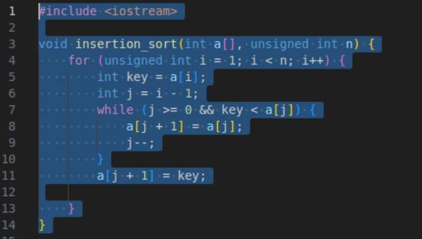
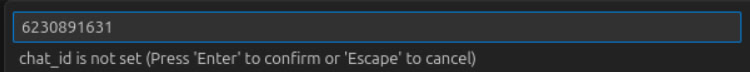
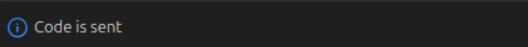
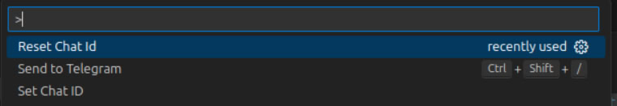
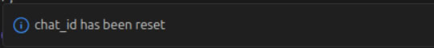
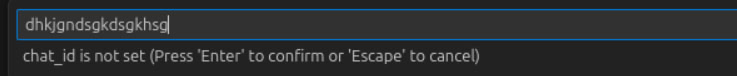
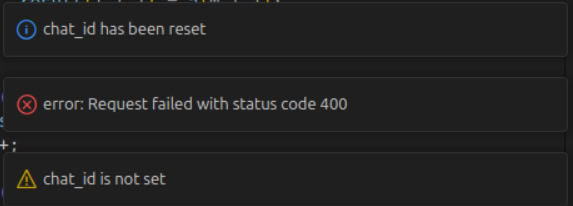

# CodeSenderTelegram

**Author:** Drobyshevsky Evgeny Olegovich  
**Group:** M3100

## Introduction

Nowadays, Telegram is becoming one of the most effective and useful social networks for communication, news consumption, and business connections. It is also popular among software developers. While working in Visual Studio Code (VSCode), developers often need to send code snippets for future use or to share them with colleagues. Unfortunately, it's not always convenient to manage code snippets in Visual Studio Code, as you might lose track of them among large amounts of code or have to create additional files to save them. Subsequently, you would need to copy your code, open Telegram, and then paste it somewhere. The idea behind the CodeSenderTelegram extension is to simplify this process, allowing you to bypass these routine tasks.

### With the CodeSenderTelegram extension, developers can:

1. Efficiently share code snippets.
2. Support multiple programming languages.
3. Facilitate collaboration.
4. Easily transport code snippets in Markdown format.

## Get Started

1. Send `/start` or click the **Start** button in the chat with the Telegram bot CodeSender (find it by nickname [@code_sender_bot](https://t.me/code_sender_bot)).
2. Locate the extension in the VSCode Extensions Marketplace by searching for "CodeSenderTelegram" or by using this [link](https://marketplace.visualstudio.com/items?itemName=needosleep.codesendertelegram). Alternatively, you can enter VSCode, press `Ctrl+P`, and paste the command: `ext install needosleep.codesendertelegram`.
3. Install the extension and relaunch VSCode.
4. If the extension is enabled, select some code within a file and press `Ctrl+Shift+/`. You can also manually launch it with `Ctrl+Shift+P` and find the command “Send to Telegram.”
5. Enter your Chat ID in the input window. You can find your Chat ID by going to **Saved Messages** in Telegram Web. If you use the Telegram app, write to [@userinfobot](https://t.me/userinfobot), and it will send you your Chat ID information.
6. Congratulations, your code has been sent!

## Commands

You can find the commands for the extension in the command palette (press `Ctrl+Shift+P`):

1. **Send To Telegram:** This command performs the same function as the keyboard shortcut `Ctrl+Shift+/`, sending the selected code and requesting your Chat ID if it isn't set.
2. **Set Chat ID:** This command allows you to set or change your Chat ID manually. If you enter an incorrect Chat ID, it will present an error message, and you'll need to try again.
3. **Reset Chat ID:** This command allows you to delete your current Chat ID if it's incorrect (for instance). It is automatically triggered when you attempt to enter an invalid Chat ID.

## Examples

1. Let's suppose we want to send a code snippet of insertion sort. We need to select the code as shown below:

   

   After this, the following input window will appear; let's enter a valid Chat ID:

   

   The result will be displayed at the bottom right of the current VSCode window:

   

2. Now, let's suppose we want to reset the Chat ID:

   

   The result will be:

   

   Let's enter a random string of symbols:

   

   The result will be:

   

   We see that after receiving the error, the `chat_id` was not set but was successfully reset.

## History of Changes

### October 15, 2024, 12:10:34 +0300

- **Commit:** b6b0cb84645764907475d4a1c7be94c24b741b7d  
- **Message:** The first version of the extension was done  
- **Changes:** The majority of the code was added, initially named CodeSenderExtension; the raw version of the extension was made.

### October 15, 2024, 12:35:18 +0300

- **Commit:** c3462a230a0bb3a8725852daa7940ff0f186a4ba  
- **Message:** README file was added & functions were separated    
- **Changes:** The single large function "activate" was divided into "sendToTelegram," "setChatId," and "resetChatId." A README file was created, and text sections were added; CodeSenderExtension was renamed to CodeSenderTelegram.

### October 15, 2024, 14:56:07 +0300

- **Commit:** b57f5ead613541fc9a5aa3f34b59053260b9ac25  
- **Message:** README file was updated: information about installing of the extension and its commands was added   
- **Changes:** Introductory text, capabilities, and instructions were included in the README file; the publisher's name and repository name were added into `package.json`.

### October 15, 2024, 17:05:37 +0300

- **Commit:** 0e214d4e186f84f89a870a0a7081dc9f79ecac37  
- **Message:** README file was updated: examples of launching were added  
- **Changes:** Examples of launching were included in the README file.

### October 15, 2024, 17:11:16 +0300

- **Commit:** 6eac8305f1faf5c8c17c4fceb1e00f5d43f03e33  
- **Message:** extension.js was updated: some comments were added  
- **Changes:** Helpful comments were incorporated into `extension.js`.

## LICENSE

This extension is provided with the MIT licence, you can see it in the repository.