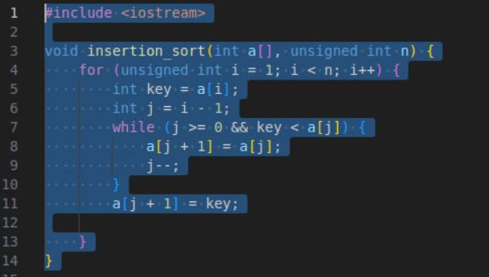
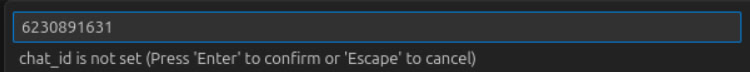
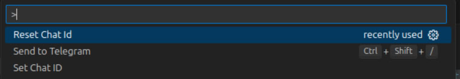
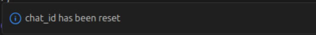
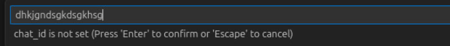
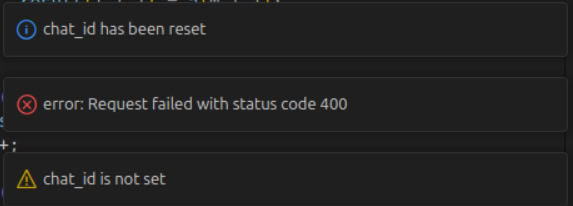

# CodeSenderTelegram

## Author: Drobyshevsky Evgeny Olegovich, group: M3100

### Introductory

- Nowadays Telegram is going to be the most effective and useful social network for communicating. It's also popular among software developers. And working in vscode, you can often be needed in sending some code snippets to use it in the future or to send it, for instance, to your colleagues. So, it isn't so comfortable to use Visual Studio Code to save snippets because you can either lose it between large bunches of code or you'll have to create extra files to save little snippets. And after that you'll need to copy your code, enter Telegram and only after that paste it somewhere. The idea of the extension CodeSenderTelegram is that you can not to do these routine things and instead of it use a simple way of doing that.
- With the CodeSenderTelegram extension developers can:
    1. Efficiently share code
    2. Support multiple languages
    3. Facilitate Collaboration
    4. Easily transport code snippets in markdown

### Get Started

1. Send /start or click start button to the telegram bot CodeSender by nickname @code_sender_bot or by link https://t.me/code_sender_bot
2. Find the extension in VSCode extensions marketplace by CodeSenderTelegram or by link https://marketplace.visualstudio.com/items?itemName=needosleep.codesendertelegram. You can also 
enter VSCode, press Ctrl+P, and paste the command: `ext install needosleep.codesendertelegram`
3. Install extension and relaunch VSCode.
4. If the extension is enabled then you can try to select some code being in a file and then press ctrl+shift+/ (or you can manually launch it with ctrl+shift+p and find the command Send to Telegram)
5. Enter your chat ID into the input window. You can find your chat ID entering to Saved Messages in Telegram Web. If you use Telegram App, then write to @userinfobot and it will send you information about your chat ID.
6. Congratulations, your code was sent!

### Commands

- You can find the commands of the extension in the command palette(press Ctrl+Shift+P):
    1. Send To Telegram - it does exactly the same fing as the keyboard shortcut Ctrl+Shift+/, e.g. it sends selected code asking your chat ID if it isn't set.
    2. Set Chat ID - it provides to set or change your Chat ID manually. If you enter the wrong Chat ID, it will show error. You should try again.
    3. Reset Chat ID - it provides to delete your Chat ID, if it's wrong(for instance). It is automatically called when you're trying to enter the wrong Chat ID.

### Examples

1. Let's suppose that we want to send a code snippet of insertion sort. We need to select the code the next way:

    

    After that we will get the next input window, let's enter some chat ID:

    

    The result will be showed at the right bottom of the current window of VSCode:

    

2. Let's suppose that we want to reset Chat ID:

    

    The result will be:

    

    Let's enter a random string of symbols:

    

    The result will be:

    

    We see that after getting the error chat_id wasn't set and but was reset.

### History of changes